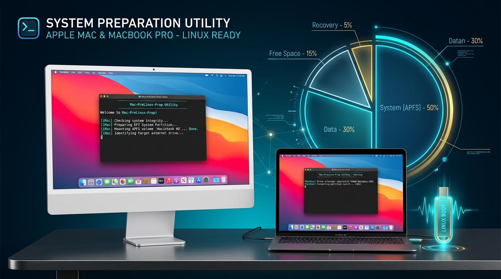

# Mac-PreLinux-Prep 🍏⚡



[](https://opensource.org/licenses/MIT)
[](https://www.apple.com/macos/)

**Mac-PreLinux-Prep** is an all-in-one macOS preparation utility and pre-flight toolkit designed to run directly inside **macOS** before installing Linux. It automates APFS partition shrinking, bootable USB creation, T2 Security Chip setup, Time Machine backups, and rEFInd bootloader installation.

---

## 🌟 Features

* 🔍 **Pre-Flight Hardware Audit**: Inspects Mac model, year, CPU (Intel vs Apple Silicon), RAM, T2 Security Chip, FileVault status, and SIP status.
* 💾 **1-Click APFS Partition Assistant**: Safely resizes `Macintosh HD` using macOS `diskutil apfs resizeContainer` to make room for Linux dual-boot without losing macOS data.
* 📀 **Bootable USB Creator for macOS**: Downloads & flashes any Linux ISO (Ubuntu, Fedora, Arch, Linux Mint, Pop!_OS) to a USB drive using native `diskutil` & `dd`.
* 🛡️ **T2 & Startup Security Assistant**: Provides automated instructions for 2018-2020 T2 Macs (disabling Secure Boot & enabling external boot in macOS Recovery).
* 🔀 **rEFInd Bootloader Installer**: Installs `rEFInd` directly from macOS into the EFI partition before installing Linux.
* ⏱️ **Time Machine Trigger**: Initiates a safety backup of macOS before disk modifications.

---

## 🚀 Quick Start on macOS

Open **Terminal** on macOS (`Cmd + Space` $\rightarrow$ type `Terminal` $\rightarrow$ press Enter) and run:

```bash
git clone https://github.com/shreyastouih-ctrl/mac-prelinux-prep.git
cd mac-prelinux-prep
chmod +x mac_prep.sh scripts/*.sh
./mac_prep.sh
```

---

## 🎛️ macOS Pre-Linux Menu (`mac_prep.sh`)

```
=================================================================
             🍏 MAC-PRELINUX-PREP (macOS Tool) ⚡
   Pre-Flight Audit & Partition Assistant for macOS Users
=================================================================
 1) Run Pre-Flight Mac Hardware & Security Audit
 2) Safely Shrink APFS Container (Create Free Space for Linux)
 3) Create Bootable Linux USB Flash Drive (diskutil + dd)
 4) T2 Security Chip & Startup Security Utility Assistant
 5) Pre-Install rEFInd Graphical Bootloader on macOS EFI
 6) Trigger Time Machine Backup before Disk Modification
 0) Exit
=================================================================
```

---

## 📄 License

Distributed under the MIT License. See `LICENSE` for details.
